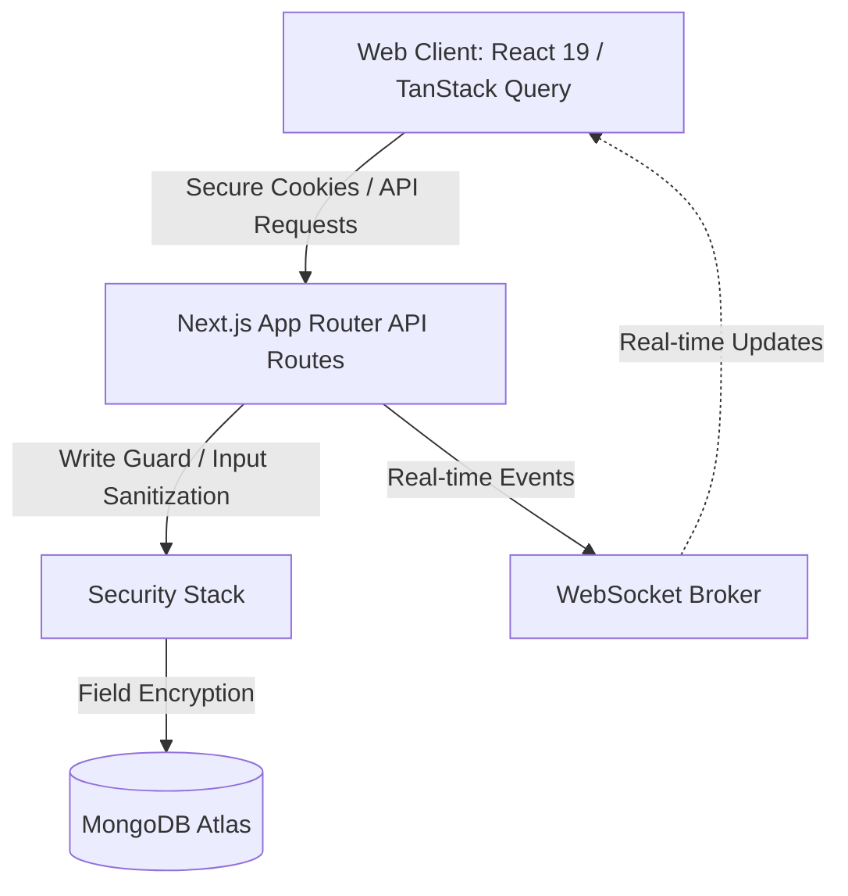

# Karigar — Workforce Operations OS

Karigar is an enterprise-grade, highly secured Workforce Operations OS designed to centralise employee management, attendance discipline, operational tasks, credit lines, and payroll analytics in one single-tenant or multi-tenant workspace.

Built using Next.js App Router (React 19 + TypeScript), TanStack Query, and MongoDB with Mongoose, Karigar prioritises visually stunning cinematic designs and rigorous production security.

---

## 🏛️ System Architecture



### Technical Stack
* **Frontend**: Next.js App Router (React 19, Tailwind CSS, shadcn/ui, Recharts)
* **State Management**: TanStack React Query v5 (Optimistic updates, cached queries)
* **Backend**: Next.js Server Route Handlers (Edge-ready serverless architecture)
* **Database**: MongoDB Atlas + Mongoose ODM (Connection pooling, index optimization)
* **Security & Auth**: Custom session store, client rate-limiting, field-level encryption, request size limits, and script injection filters.

---

## 📦 Database Schemas & Models

Karigar operates on Mongoose schemas with indexed querying for performant data lookup.

### 1. `UserModel` (`users`)
Stores credentials and workspace roles.
```typescript
interface IUser {
  username: string; // unique, lowercase
  email?: string;    // unique, sparse
  mobile?: string;   // unique, sparse
  password: string;  // bcrypt hash
  role: 'admin' | 'user'; // user represents tenant employer
}
```

### 2. `EmployeeModel` (`employees`)
Tracks tenant workforce records.
```typescript
interface IEmployee {
  ownerId: string; // references User ID (Workspace owner)
  name: string;    // indexed
  salary: number;  
  joiningDate: string; // YYYY-MM-DD
  mobile: string;
  email: string;
  role: string;
  profilePhoto?: string;
  status: 'active' | 'inactive';
}
```

### 3. `AttendanceModel` (`attendance`)
Stores date-wise attendance records with a unique compound index: `{ employeeId: 1, date: 1 }`.
```typescript
interface IAttendance {
  ownerId: string;
  employeeId: string;
  date: string; // YYYY-MM-DD
  status: 'present' | 'absent' | 'half-day' | 'sick-leave' | 'paid-leave';
}
```

### 4. `CreditModel` (`credits`)
Tracks advances and loan records for employees.
```typescript
interface ICredit {
  ownerId: string;
  employeeId: string;
  amount: number;
  dateTaken: string; // YYYY-MM-DD
  promiseReturnDate: string; // YYYY-MM-DD
  isPaid: boolean;
}
```

### 5. `TaskModel` (`tasks`)
Manages task assignments and completion state.
```typescript
interface ITask {
  ownerId: string;
  employeeId: string;
  title: string;
  description: string;
  deadline: string;
  priority: 'high' | 'medium' | 'low';
  isCompleted: boolean;
}
```

---

## 🎯 Product Functional Requirements (PRD)

### 1. Attendance Intelligence
* **Requirement**: Record presence, sick leaves, paid leaves, and half-days.
* **Redundancy Protection**: Automatic auto-reset function triggered daily.
* **Bulk Check**: Allow managers to perform rapid check-ins straight from the home dashboard list.

### 2. Credit & Advance Tracking
* **Requirement**: Log loans issued to workforce members.
* **Visual Warning**: Displays outstanding totals inside the KPI cards and individual employee profiles.
* **Due Date Tracking**: Highlights pending return dates to prevent bad debt accumulation.

### 3. Operational Task Pipeline
* **Requirement**: Task assignment with priority weights.
* **Real-time Synchronization**: Instant client UI reload via React Query mutations and optional WebSockets upon completion toggles.

### 4. Consolidated Reporting & Analytics
* **Requirement**: Live operational graphs.
* **UI Widgets**: Interactive area charts showing active workspace stats, and bar graphs representing monthly payroll breakdowns.
* **Exporting**: Supports direct Excel sheet extraction (`exceljs`) of compliance records.

### 5. Admin Console (Super-Admin)
* **Requirement**: Global tenant visibility.
* **Metrics Grid**: Super-admins (`role: 'admin'`) can inspect workspace sizes, count user accounts, and track metrics across the database cluster.

---

## 🔒 Security & Data Protection Stack

Karigar implements a rigorous, multi-layered security infrastructure:

### 🛡️ Write Request Guard (`lib/api-write-guard.ts`)
Intercepts all state-changing operations (`POST`, `PUT`, `PATCH`, `DELETE`):
* **Rate Limiting**: Custom window-based IP rate limits (`lib/api-rate-limit.ts`).
* **Payload Bounds**: Enforces maximum payload size limits (default `1MB`) to block buffer overflows.
* **Keys Sanitization**: Strips dangerous NoSQL operator prefixes (`$`, `.`) from payload keys.

### 🧼 Input Sanitizer & Honeypot (`lib/input-sanitizer.ts`)
* Prevents XSS, SQL/NoSQL Injection, and HTML tag injections by sanitizing user strings.
* Real-time audit logs trigger immediately when malicious injection patterns are detected.

### 🔑 Cryptographic Data Protection (`lib/field-encryption.ts`)
* Uses AES-256-CBC with a system `ENCRYPTION_KEY` to encrypt sensitive user details (e.g. mobile numbers and emails) inside MongoDB.
* Automatically decrypts transparently at the application level during query execution.

---

## 🔌 API Reference Guide

### Authentication
* `POST /api/auth/login`: Authenticate credentials and write session token to HTTP-only cookie.
* `POST /api/auth/register`: Create a new workspace, hash passwords with bcrypt, and initiate settings.
* `POST /api/auth/logout`: Clear database session records and expire auth cookies.

### Workforce Operations
* `GET /api/employees`: Retrieve employees in user's workspace (supports pagination).
* `POST /api/employees`: Onboard new workforce member.
* `GET /api/attendance/employee/[id]`: Retrieve log history of a worker.
* `POST /api/attendance`: Create or update check-in record.
* `GET /api/credits`: List all loan records.
* `POST /api/credits`: Issue new financial advance.
* `GET /api/tasks`: List active task assignments.
* `POST /api/tasks`: Assign new task.

### Analytics & Dev Operations
* `GET /api/stats`: Fetch real-time dashboard KPIs.
* `POST /api/seed`: Seed the workspace. Required payload: `{ "secret": "karigar-seed-2026" }`.

---

## 🚀 Setup & Local Development

### 1. Prerequisites
Ensure you have **Node.js 18+** and **npm** or **pnpm** installed.

### 2. Environment Configuration
Create a `.env.local` file in the root directory:
```env
MONGODB_URI=mongodb+srv://<username>:<password>@cluster.mongodb.net/karigar
NEXT_PUBLIC_API_URL=http://localhost:3000
NODE_ENV=development
NEXT_PUBLIC_ENABLE_MONGODB=true
ENCRYPTION_KEY=48b590cc90f924f3f39de18b57ff81315d4e92a243b2b9fe9e9faef070aad84e
SEED_SECRET=karigar-seed-2026
```

### 3. Install & Start Development Server
```bash
npm install
npm run dev
```

### 4. Seeding Demo Account
To seed the mock workspace for demonstration purposes, call the seed API:
```bash
curl -X POST http://localhost:3000/api/seed \
  -H "Content-Type: application/json" \
  -d '{"secret":"karigar-seed-2026"}'
```

**Demo Workspace Login:**
* **Email**: `milan_enterprises@gmail.com`
* **Password**: `Milan@123`
* *Provides 10 Indian employees, 10 days of attendance logs, 2 tasks, and 2 active loans out of the box.*
